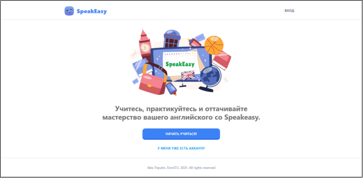
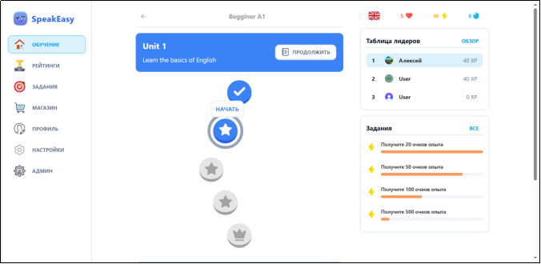

These are web-based application for learning English.  
The application interface is similar to [Duolingo](https://www.duolingo.com/).   
The application was created for teaching web programming technologies.

## 🛠️ Technology stack

**Next.js 14**   
**Typescript**   
**Tailwind CSS**  
**Neon + PostgreSQL**    
**Clerk Auth**

## 🎮 Live Demo

Don't want to install? Just click and try it!

  

**Link access:** https://speakeasy-e73u.vercel.app

## 📸 Screenshots

### Welcome screen

  

### Home screen

  

## 📞 Contact
Alex \\
Telegram - [@digital1style](https://t.me/digital1style) \\
Email - otriputin@gmail.com \\

Project: https://github.com/starboyone/speakeasy
